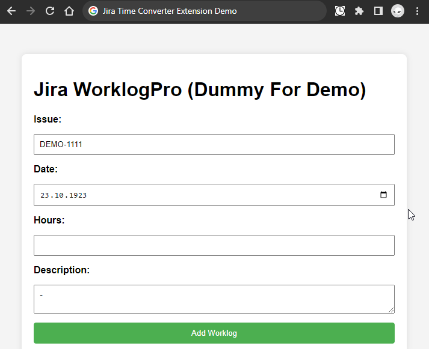
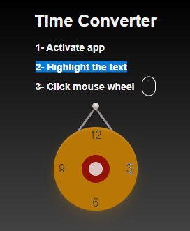

# Jira Time Converter

The Jira Time Converter is a Google Chrome extension designed to convert time formats specified with a dot, such as 8.4h, into the hour-minute format, like 8h 24m.
<br><br>
This extension was developed in response to a bug in the **Jira WorklogPro plugin** at my workplace. This issue prevented users from entering logs in the dot hour format, leading to the need for manual conversion to the hour-minute format. The bug has caused inconvenience, and I developed this extension to serve as a temporary solution until the bug is fixed.

### Demo



### How to Use

1. **Clone the jira-time-converter repository from GitHub:**

    ```
       git clone https://github.com/Aknbb/jira-time-converter.git
    ```

2. **Install the Extension:**

   1. In your Google Chrome application, go to the address "chrome://extensions/" and activate the developer mode located in the upper right corner.
   
   2. Click on the "Load unpacked" button and select the directory you downloaded using the "git clone" command.
   
   3. The application 'Jira Time Converter Extension 1.0' will be visible in the list of extensions.

3. **Activate the Extension:**

   1. Click on the extension icon of the Jira Timer Converter in the Chrome toolbar to activate the tool.
   
   2. To activate the application, click on the center of the clock, and a green check mark will appear.
   


4. **Convert Time Input:**
    1. Write the time format specified with a dot.
    
    2. Highlight your input using your mouse.
    
    3. Click the middle button of your mouse to convert.


### License

This project is licensed under the [MIT License](LICENSE).

#### Contact
Feel free to explore my Jira Time Converter project and get in touch if you have any questions or collaboration ideas. You can reach out to me via [akinbuyukbulut@gmail.com](mailto:akinbuyukbulut@gmail.com) or connect with me on [LinkedIn](https://www.linkedin.com/in/akinbuyukbulut/) and [GitHub](https://github.com/Aknbb).
